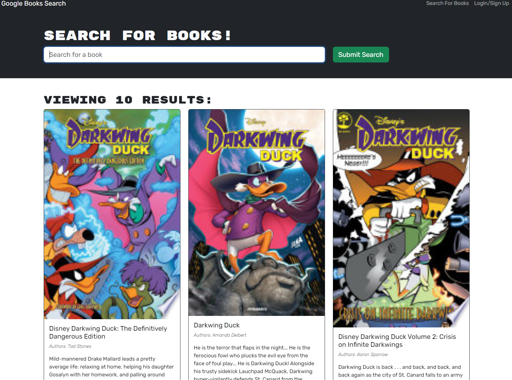

# React Portfolio

[Link to Live App](https://ds055.github.io/react-portfolio/)

## Description
Google Book Search is a search engine that derives information from GoogleBooks. This app allows users to create an account and save a list of books from the database.  

## Screenshot

## Installation
* N/A

## Usage
* Navigate to the website. 
* Use the search bar to query for titles or subjects. 
* You can search without logging in or creating an account, but you can't save any of the search results.
* To save a book, log in or create an account and repeat the desired search to find the book you'd like.
* On the card of the book you'd like to save, click the blue "Save this Book!" button. 
* To see your saved book(s), click on the "See Your Books" link.
* To remove books from your list, click the red "Delete this Book!" button on the bottom of the card of the book you'd like to remove. 

## References
* Referenced Activites (Unit-Activity) 20-12, 21-4, 21-8, 21-10, 21-13, 21-15, 21-16, 21-23, 21-24, 21-25, 21-26
* Referenced Mini Project code from Unit 21
* Assistance from the instructor

### Input Type Resources
* [Egghead.io Article](https://egghead.io/lessons/apollo-wrap-graphql-mutation-arguments-with-a-graphql-input-type)
* [Jamie Barton GraphQL Input Types](https://www.youtube.com/watch?v=YB0q1WshdLw)
* ["Building Chatty" Tutorial](https://medium.com/react-native-training/building-chatty-part-8-graphql-input-types-784af811dc31)

### Updating Page after Saved-Book Deletion
* [StackOverflow Post](https://stackoverflow.com/questions/69825205/manually-refresh-react-query-onclick-with-react)
* [Apollo GraphQL ](https://www.apollographql.com/docs/react/data/queries/)

## License
Please refer to the license in the repo.
- - -